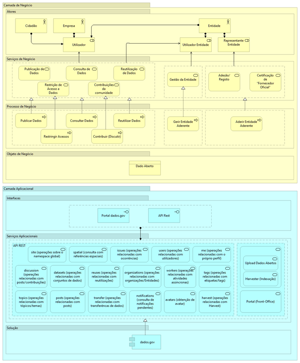

# Como está estruturada a plataforma?

O dados.gov baseia-se na plataforma [Udata](https://udata.readthedocs.io/en/stable/), um produto criado pelo [Etalab](https://www.etalab.gouv.fr/), uma estrutura de missão da Administração Pública francesa. É desenvolvido e disponibilizado numa lógica _open source_.

Abaixo o diagrama de alto nível do dados.gov, demonstrando na Camada de Negócio os atores e papéis envolvidos, os serviços de negócio e os processos, e na Camada Aplicacional os serviços aplicacionais que realizam seus processos.

<figure><figcaption>
Diagrama de arquitetura de alto nível dados.gov
</figcaption></figure>
