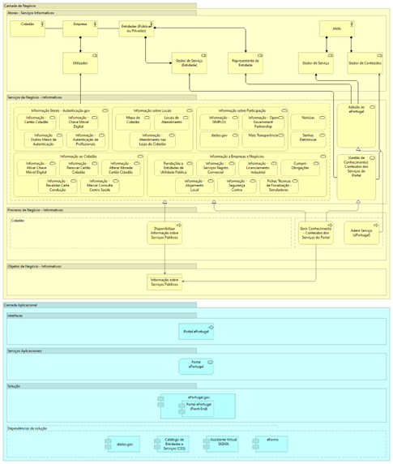
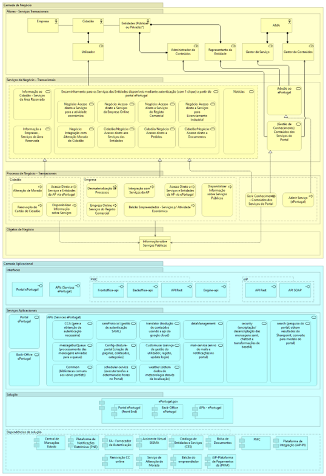

# Como está estruturada a plataforma?

O ePortugal tem duas vertentes, uma de **informação pública** (designados de serviços informativos) e outra de **serviços públicos apenas disponíveis mediante autenticação** (designados de serviços transacionais).

Para os serviços informativos, que não requerem autenticação e apenas disponibilizam informação ou suportam simulações, temos a arquitetura representada no diagrama abaixo:

<figure><figcaption>
Diagrama de alto nível do ePortugal para os Serviços Informativos (Área Pública)
</figcaption></figure>

Para os serviços transacionais, que requerem autenticação e suportam a realização de procedimentos administrativos, temos:

<figure><figcaption>
Diagrama de alto nível do ePortugal para os Serviços Transacionais (requerem autenticação)
</figcaption></figure>
