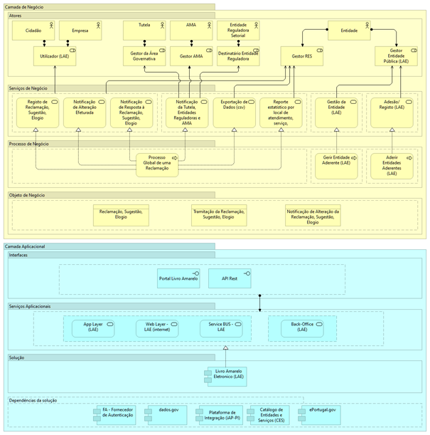

# Como está estruturada a plataforma?

O LAE tem a **arquitetura** apresentada no **diagrama de alto nível** (abaixo), onde se representa, na **Camada de Negócio,** os atores e papéis desempenhados, os serviços e os processos de negócio, e na **Camada Aplicacional**, os serviços aplicacionais que realizam os processos de negócio.

<figure><figcaption>
Diagrama de alto nível do LAE – Livro Amarelo Eletrónico
</figcaption></figure>

O diagrama acima apresenta (de cima para baixo):

* Os **atores** que interagem com o LAE o respetivo **papel**;
* Os **serviços de negócio** disponibilizados pelo LAE, e os **processos de negócio** subjacentes;
* Os **objetos de negócio** (dados) acedidos ou geridos;
* Os **serviços aplicacionais** e _**interfaces**_ disponibilizados pelo LAE;
* As **dependências** que o LAE tem com outras soluções / _building blocks._

A Entidade Aderente poderá aceder às Reclamações, Elogios e Sugestões, diretamente no _backoffice_ do Portal do Livro Amarelo, onde também é possível proceder à atualização dos respetivos estados de tratamento, ou, obter a informação das reclamações, elogios e sugestões via a Plataforma de Integração da iAP, para tratamento nos seus próprios sistemas.

O Portal do Livro Amarelo pode ser disponibilizado ao cidadão, nos sites das Entidades Aderentes, simplesmente pela disponibilização de um _link_ para este portal.
