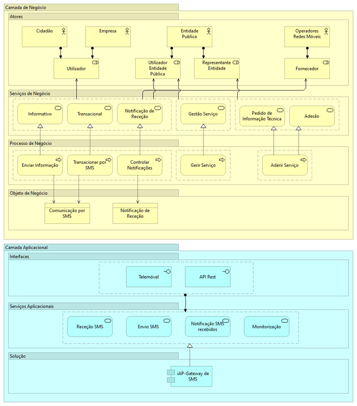

# Como está estruturada a plataforma?

A arquitetura tecnológica deste serviço é baseada numa _gateway_ (infraestrutura de servidores) que se encontra conectada com as redes dos diferentes operadores móveis. Os sistemas cliente deste serviço enviam pedidos para a _gateway_ por HTTP Post ou _Web service_, e a _Gateway_ envia esses pedidos através dos operadores móveis na forma de SMS.

Abaixo o diagrama de alto nível da GAP, demonstrando na Camada de Negócio os atores e papéis envolvidos, os serviços de negócio e os processos, e na Camada Aplicacional os serviços aplicacionais que realizam seus processos.

<figure><figcaption>
Diagrama de alto nível da Plataforma de Mensagens iAP-GAP
</figcaption></figure>
